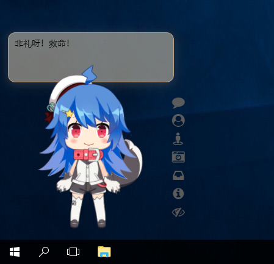
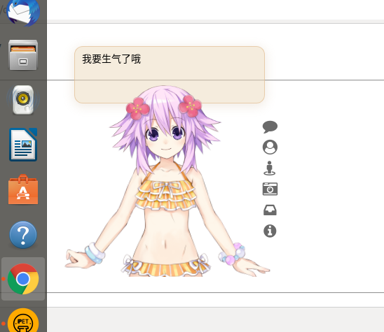
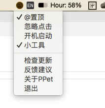

# PPet

> 给你的桌面多一点趣味~😁

[](https://github.com/zenghongtu/PPet/releases)


## 预览

### Mac 10.14


### Windows 10



### Ubuntu 18



## 功能

- [x] 本地导入 Model

  > 选择模型文件夹中的模型配置文件（一般为`model.json`/`index.json`，必须包含`model`/`textures`/`motions`三个字段，没有的话可以尝试自行添加），将会导入该配置文件所在的文件夹

  > **导入的模型如果显示不完整，可以【设置 Model】设置其宽度和高度。如果还存在问题可以尝试【重新渲染】**

  > 一些资源推荐：[xiazeyu/live2d-widget-models](https://github.com/xiazeyu/live2d-widget-models) / [xiaoski/live2d_models_collection](https://github.com/xiaoski/live2d_models_collection)/ [QiShaoXuan/live2DModel](https://github.com/QiShaoXuan/live2DModel) / [梦象](https://mx.paul.ren/) 上的 Model 还不错，可以自行下载导入

* [x] 设置 Model
  > 目前只能设置 w 和 h
* [x] @置顶
* [x] 忽略点击
* [x] 开机启动
* [x] 小工具
* [x] 拖动（按住 Alt）
* [x] 放大缩小（Ctrl/Cmd 和 +、-、0 控制）
* [x] ~~提醒休息（默认 25 分钟）~~（移到开发中心）



## 后续功能

- 插件中心【开发中】
- 选词翻译
- 换壁纸
- 记录剪切板
- 日常清理
- 自定义对话
- ...

如果你有什么好的想法，也欢迎留言交流~👏🏻

## 特别感谢

### CDN 赞助商

<a href="https://www.maoyuncloud.com" target="_blank"></a>

## 安装

[这里](https://github.com/zenghongtu/PPet/releases)去下载最新版本，或者下面的指定系统版本。

蓝奏云备份: https://www.lanzous.com/b044af9ib 密码:6g7n

### Mac

[下载](https://github.com/zenghongtu/PPet/releases/download/v1.1.0/PPet-1.1.0.dmg) .dmg

### Linux

'Debian / Ubuntu' 使用 .deb [下载](https://github.com/zenghongtu/PPet/releases/download/v1.1.0/PPet-1.1.0.deb)

### Window

[下载](https://github.com/zenghongtu/PPet/releases/download/v1.1.0/PPet-1.1.0.exe)

## 开发

```
$ yarn install
$ yarn run start
```

## 欢迎参与贡献

发现了错误? 向我发起一个 PR 吧! 参考 [Commit message 和 Change log 编写指南 - 阮一峰的网络日志](http://www.ruanyifeng.com/blog/2016/01/commit_message_change_log.html) 提交 commit 即可。

## 更多

感谢以下两个项目：

- [fghrsh/live2d_api](https://github.com/fghrsh/live2d_api) 提供的 model api 接口
- [stevenjoezhang/live2d-widget](https://github.com/stevenjoezhang/live2d-widget) 部分代码魔改自该项目

## 版权声明

MIT @ [zenghongtu](https://github.com/zenghongtu)
